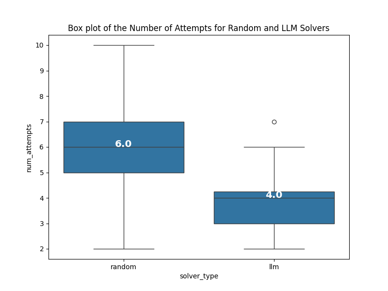
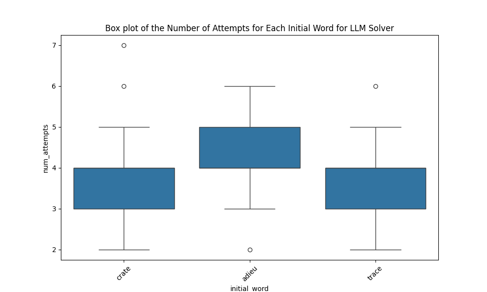

# WORDLE Solver Virtual Assistant (WSVA) Testbed

Testbed to automate the solving of WORDLE puzzles.

The list of 5-letter words used in the Wordle Solver Virual Assistant is sourced from https://github.com/dwyl/english-words.  The file `data/five-letter-words.txt` is an extract of only five-letter words from the file `words_alpha.txt` in the `english-words` GitHub repository.

Answers to past Wordle puzzles sourced from https://www.rockpapershotgun.com/wordle-past-answers, as of 27Jan2024.

GPT4 LLM is used to solve the puzzles.  Currently manual access to GPT4 via the OpenAI Playground Chat and API access is supported.  Using these parameters:
* temperature=0.1
* max_tokens=4096


## Experiment Results

### Overall Wordle Solver Virtual Assistant (WSVA) Performance: LLM vs Random


### Distribution of Number of Attempts to Solve a Wordle Puzzle: LLM vs Random


### LLM Solver Performance By Initial Word


### LLM Solver Distribution of Number of Attemps by Initial Word



## Experiments

### `src/run_experiment.py`

This Python script is designed to run an experiment using two different solvers, `random_solver` and `llm_solver`, on a set of words. The experiment results are stored in a CSV file.

Here's a step-by-step explanation:

1. The script imports necessary modules and functions from `random_solver` and `llm_solver`.

2. It defines constants for the number of words and trials to be used in the experiment, and the file path for the experiment data.

3. If the script is run as the main program, it first checks if the experiment data file already exists. If it does, the file is deleted to start a new experiment.

4. It sets a random seed for reproducibility.

5. It loads a list of words from a file, selects a random sample of these words, and converts them to lowercase.

6. It prints the command line arguments and the experiment parameters.

7. It prepares the command line arguments for the `random_solver`. Then, for each word in the test list, it adds the word and experiment file path to the command line arguments, runs the `random_solver` for the specified number of trials, and then removes the word and experiment file path from the command line arguments.

8. It does the same for the `llm_solver`, but also includes an API flag in the command line arguments.

9. Finally, it prints the command line arguments.

This script is likely part of a larger project where the performance of the `random_solver` and `llm_solver` are being compared. The solvers are probably algorithms for solving a word puzzle, and the experiment is run multiple times for different words to get a robust measure of their performance.

### `src/experiment_analysis.ipynb`

Analyses the results of the experiment.


## Observations:

### Hallucination
Example of LLM hallucinating on the explanation.  

**Prompt**:
``` 
Solve the puzzle by guessing a five-letter word using these clues.

If more than one word meets the criteria, select the word that is more common. Provide step-by-step instructions for how you arrived at the selected word. When writing the instructions, do not list words. Return only a json structure with the key 'recommendation' for the recommended word and 'explanation' for your explantion.
List of candidate words:
biddy
butin
didus
dungs
filly
flogs
flook
gibby
gully
gusty
hondo
immun
josip
jotty
judos
lusts
mommy
nobut
nould
numud
shots
sifts
sugis
undid
uninn
```

**LLM Response**:

```json
{
   "recommendation": "gusty", 
   "explanation": "The first step is to eliminate words that have repeating letters, as Wordle only uses words with unique letters. This eliminates 'biddy', 'didus', 'filly', 'flogs', 'gibby', 'mommy', 'nobut', 'nould', 'numud', 'shots', 'sifts', 'sugis', and 'undid'. The next step is to eliminate words that contain less common letters, such as 'j', 'z', 'x', 'q', and 'v'. This eliminates 'josip' and 'jotty'. The remaining words are 'butin', 'dungs', 'flook', 'gully', 'gusty', 'hondo', 'judos', 'lusts', and 'uninn'. Among these, 'gusty' is the most common word, making it the best guess."
}
```
Repeated letters are allowed in Wordle.


### Inconsistent LLM explanations

```json
{
   "recommendation": "shake", 
   "explanation": "The first step is to eliminate words that have uncommon letters or combinations. 'Seave', 'soave', 'suave', and 'swage' are eliminated because 'ea', 'oa', 'ua', and 'wa' are less common in English words. 'Shane' and 'snake' are eliminated because 'ane' and 'ake' are less common endings than 'ake'. This leaves 'shake' and 'shave'. 'Shake' is chosen because it is a more common word than 'shave'."
}
```

The reason for eliminating 'ake' is inconsistent.

### Over-prompting


```text
Solve the puzzle by guessing a five-letter word using these clues.
Remove words from consideration that contain these letters:  'c',  'u',  'h',  'n',  's',  'd',  
'i',  'p',  'l',  't'.
Words must contain these letters in the following positions: 'e' in the second, 'a' in the fifth.
Words must contain these letters with the position restrictions:  'a' must not be in the first position,  
'e' must not be in the third position,  'r' must not be in the third position,  
'a' must not be in the third position,  'e' must not be in the fourth position.
If more than one word meets the criteria, select the word that is more common. Provide step-by-step 
instructions for how you arrived at the selected word. When writing the instructions, do not list words. 
Return only a json structure with the key 'recommendation' for the recommended word and 'explanation' 
for your explantion.
List of candidate words:
bemba
gemma
regga
regma
zebra
```

These instructions were already taken care of by regex filtering of the source word list.
```text
Remove words from consideration that contain these letters:  'c',  'u',  'h',  'n',  's',  'd',  
'i',  'p',  'l',  't'.
Words must contain these letters in the following positions: 'e' in the second, 'a' in the fifth.
Words must contain these letters with the position restrictions:  'a' must not be in the first position,  
'e' must not be in the third position,  'r' must not be in the third position,  
'a' must not be in the third position,  'e' must not be in the fourth position.
```

Afer removing the extraneous instructions the quality of recommended word appears to be improved.  More testing is needed to quantify this, e.g., compared to random guessing.

